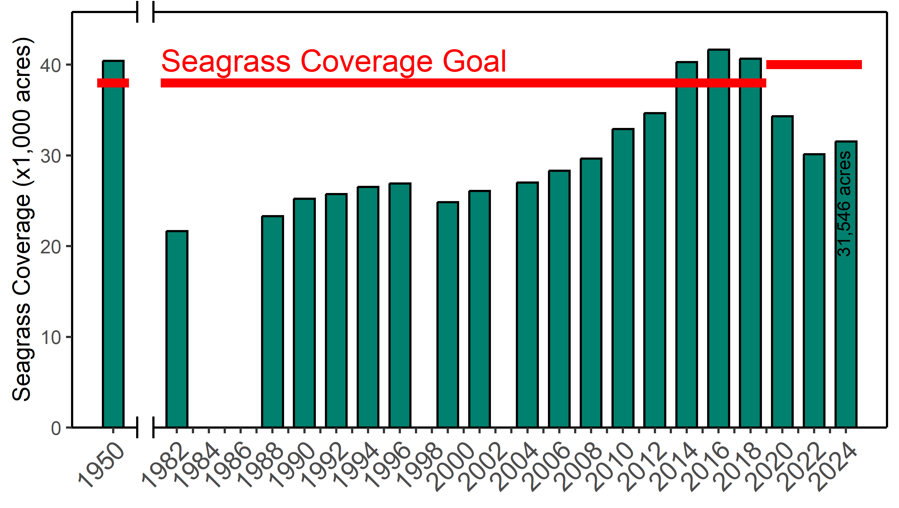

# {.tabset}

This application provides a summary of seagrass areal coverage estimates for Tampa Bay, by major bay segments and seagrass management areas.  Coverage estimates are provided for each year of available coverage data from the Southwest Florida Water Management District, published approximately biennially since the 1980s (available [here](https://data-swfwmd.opendata.arcgis.com/search?groupIds=d9a4213eb9ea4713bb710e03bdcc6648)). All estimates are provided in acres.  

The Tampa Bay tab provides a summary for the entire bay using historical estimates for past years.  Due to changes in the segment boundaries and updates to the historical coverage layers, these summaries may differ slightly from the total acreages provides in the segment and management area tabs.    

Comparisons of past years to the current year (2020) can be made for the segment and management area tabs by selecting a prior year from the dropdown menu.  Note that the nominal year for each layer provides a snapshot estimate of coverage from aerial photos taken at the end of the growing season for the year prior.  For example, the 2020 layer was based on images obtained in December 2019.  

<a rel='license' href='http://creativecommons.org/licenses/by/4.0/'></a>&nbsp;&nbsp;This application is licensed under a <a rel='license' href='http://creativecommons.org/licenses/by/4.0/'>Creative Commons Attribution 4.0 International License</a>. Please contact [Marcus Beck](mailto:mbeck@tbep.org) for more information. Source code is available [here](https://github.com/tbep-tech/seagrass-analysis).

```{r setup, message = F, warning = F, results = 'hide', echo = F}
knitr::opts_chunk$set(echo = TRUE, warning = F, message = F, echo = F, fig.path = 'figs/', fig.path = 'figures/')
box::use(
  here[...], 
  dplyr[...],
  shiny[...], 
  leaflet[renderLeaflet, leafletOutput],
  tidyr[spread, gather],
  reactable[reactableOutput, renderReactable], 
  knitr[include_graphics, kable], 
  R/funcs[sgrctfun, sgmapfun]
)
data(file = 'seagrass', package = 'tbeptools')
data(file = 'sgseg', package = 'tbeptools')
data(file = 'sgmanagement', package = 'tbeptools')
load(file = here('data/allsegests.RData'))
load(file = here('data/allmngests.RData'))

# years to select
yrs <- unique(allsegests$yr) %>% 
  sort %>% 
  .[1:(length(.))]

# combined segment estimates
segcmbests <- allsegests %>% 
  filter(Habitat %in% c('patchy', 'cont.')) %>% 
  group_by(yr, Segment) %>% 
  summarise(
    Acres = sum(Acres, na.rm = T), 
    .groups = 'drop'
    ) %>% 
  spread(yr, Acres, fill = 0)

# patchy segment estimates
segptcests <- allsegests %>% 
  filter(Habitat == 'patchy') %>% 
  select(yr, Segment, Acres) %>% 
  spread(yr, Acres, fill = 0)

# continuous segment estimates
segcntests <- allsegests %>% 
  filter(Habitat == 'cont.') %>% 
  select(yr, Segment, Acres) %>% 
  spread(yr, Acres, fill = 0)

# combined management estimates
mngcmbests <- allmngests %>% 
  filter(Habitat %in% c('patchy', 'cont.')) %>% 
  group_by(yr, Areas) %>% 
  summarise(
    Acres = sum(Acres, na.rm = T), 
    .groups = 'drop'
    ) %>% 
  spread(yr, Acres, fill = 0)

# patchy management estimates
mngptcests <- allmngests %>% 
  filter(Habitat == 'patchy') %>% 
  select(yr, Areas, Acres) %>% 
  spread(yr, Acres, fill = 0)

# continuous management estimates
mngcntests <- allmngests %>% 
  filter(Habitat == 'cont.') %>% 
  select(yr, Areas, Acres) %>% 
  spread(yr, Acres, fill = 0)

# max segment value
segmaxv <- segcmbests %>% 
  select_if(is.numeric) %>% 
  max()

# max management value
mngmaxv <- mngcmbests %>% 
  select_if(is.numeric) %>% 
  max()

# leaflet height
lfht <- 600
```

```{r reactives}
# segment combined trend table
segcmbtab <- reactive({
  
  # inputs
  yrsel1 <- input$yrsel1
  out <- sgrctfun(segcmbests, 'Segment', yrsel = yrsel1)

  return(out)
  
})

# segment combined map
segcmbmap <- reactive({
  
  # inputs
  yrsel1 <- input$yrsel1
  out <- sgmapfun(segcmbests, 'Segment', yrsel = yrsel1, bndin = sgseg, maxv = segmaxv)

  return(out)
  
})

# segment cont trend table
segcnttab <- reactive({
  
  # inputs
  yrsel1 <- input$yrsel1
  out <- sgrctfun(segcntests, 'Segment', yrsel = yrsel1)

  return(out)
  
})

# segment cont map
segcntmap <- reactive({
  
  # inputs
  yrsel1 <- input$yrsel1
  out <- sgmapfun(segcntests, 'Segment', yrsel = yrsel1, bndin = sgseg, maxv = segmaxv)

  return(out)
  
})

# segment patchy trend table
segptctab <- reactive({
  
  # inputs
  yrsel1 <- input$yrsel1
  out <- sgrctfun(segptcests, 'Segment', yrsel = yrsel1)

  return(out)
  
})

# segment patchy map
segptcmap <- reactive({
  
  # inputs
  yrsel1 <- input$yrsel1
  out <- sgmapfun(segptcests, 'Segment', yrsel = yrsel1, bndin = sgseg, maxv = segmaxv)

  return(out)
  
})

# management area combined trend table
mngcmbtab <- reactive({
  
  # inputs
  yrsel2 <- input$yrsel2
  out <- sgrctfun(mngcmbests, 'Areas', yrsel = yrsel2)

  return(out)
  
})

# management area combined map
mngcmbmap <- reactive({
  
  # inputs
  yrsel2 <- input$yrsel2
  out <- sgmapfun(mngcmbests, 'Areas', yrsel = yrsel2, bndin = sgmanagement, maxv = mngmaxv)

  return(out)
  
})

# management area cont trend table
mngcnttab <- reactive({
  
  # inputs
  yrsel2 <- input$yrsel2
  out <- sgrctfun(mngcntests, 'Areas', yrsel = yrsel2)

  return(out)
  
})

# management area cont map
mngcntmap <- reactive({
  
  # inputs
  yrsel2 <- input$yrsel2
  out <- sgmapfun(mngcntests, 'Areas', yrsel = yrsel2, bndin = sgmanagement, maxv = mngmaxv)

  return(out)
  
})

# management area patchy trend table
mngptctab <- reactive({
  
  # inputs
  yrsel2 <- input$yrsel2
  out <- sgrctfun(mngptcests, 'Areas', yrsel = yrsel2)

  return(out)
  
})

# management area patchy map
mngptcmap <- reactive({
  
  # inputs
  yrsel2 <- input$yrsel2
  out <- sgmapfun(mngptcests, 'Areas', yrsel = yrsel2, bndin = sgmanagement, maxv = mngmaxv)

  return(out)
  
})
```

## Tampa Bay

```{r}
kable(seagrass, caption = 'All estimates for all segments, based on historical coverages used to report on annual progress toward recovery goals.', digits = 0)
```

[download figure](https://github.com/tbep-tech/seagrass-analysis/raw/main/figures/seagrasscov.png){target="_blank"}

```{r, out.width = '100%'}

```

## By segment {.tabset .tabset-pills}

```{r}
selectInput('yrsel1', 'Select year comparison', choices = yrs, selected = yrs[1])
```

##### `r renderText(input$yrsel1)` to 2020 change {.tabset .tabset-pills} 

### Continous + Patchy

```{r}
output$segcmbtab <- renderReactable(segcmbtab())
reactableOutput('segcmbtab')
```

```{r}
output$segcmbmap <- renderLeaflet(segcmbmap())
leafletOutput('segcmbmap', height = lfht)
```

### Continuous

```{r}
output$segcnttab <- renderReactable(segcnttab())
reactableOutput('segcnttab')
```

```{r}
output$segcntmap <- renderLeaflet(segcntmap())
leafletOutput('segcntmap', height = lfht)
```

### Patchy

```{r}
output$segptctab <- renderReactable(segptctab())
reactableOutput('segptctab')
```

```{r}
output$segptcmap <- renderLeaflet(segptcmap())
leafletOutput('segptcmap', height = lfht)
```

## By management area {.tabset .tabset-pills}

```{r}
selectInput('yrsel2', 'Select year comparison', choices = yrs, selected = yrs[1])
```

##### `r renderText(input$yrsel2)` to 2020 change {.tabset .tabset-pills} 

### Continous + Patchy

```{r}
output$mngcmbtab <- renderReactable(mngcmbtab())
reactableOutput('mngcmbtab')
```

```{r}
output$mngcmbmap <- renderLeaflet(mngcmbmap())
leafletOutput('mngcmbmap', height = lfht)
```

### Continuous

```{r}
output$mngcnttab <- renderReactable(mngcnttab())
reactableOutput('mngcnttab')
```

```{r}
output$mngcntmap <- renderLeaflet(mngcntmap())
leafletOutput('mngcntmap', height = lfht)
```

### Patchy

```{r}
output$mngptctab <- renderReactable(mngptctab())
reactableOutput('mngptctab')
```

```{r}
output$mngptcmap <- renderLeaflet(mngptcmap())
leafletOutput('mngptcmap', height = lfht)
```
